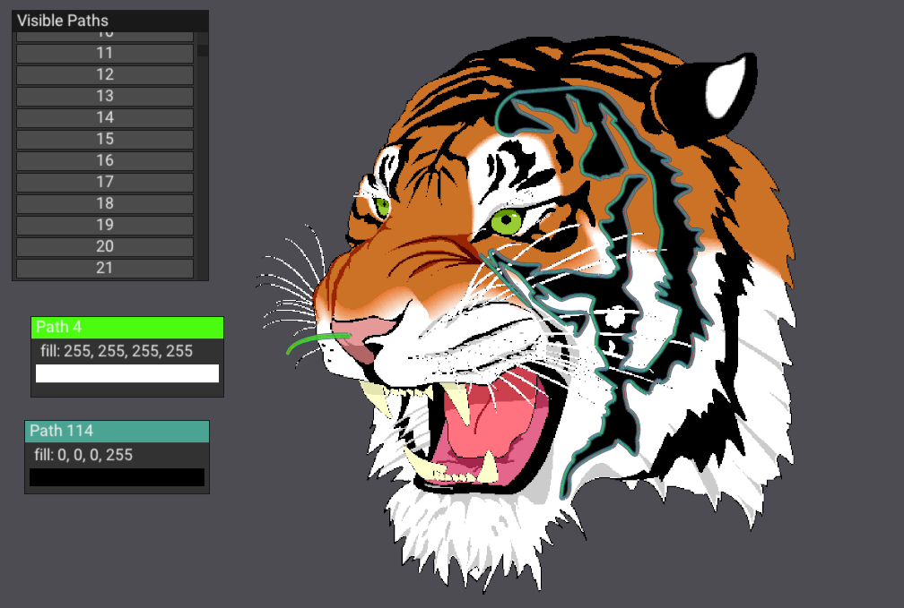
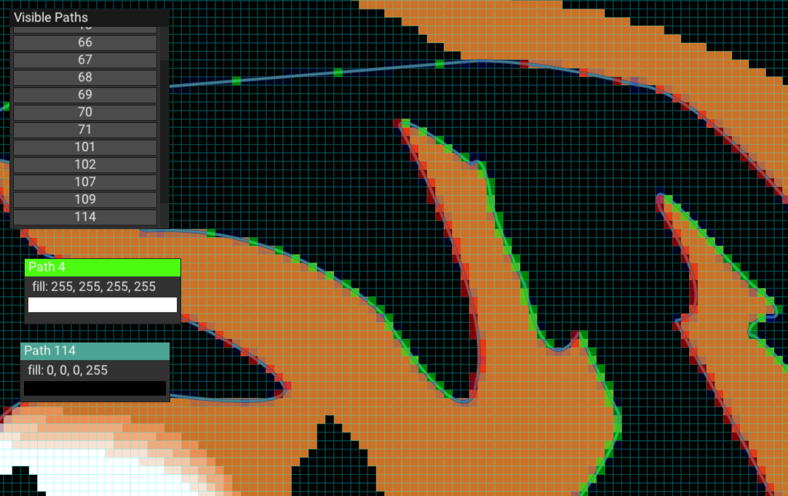

# raster

*Disclaimer (archived exploration): This project is not meant to be used in any serious way. Feel free to get inspired, but keep in mind that I would probably do things differently now.*

Vector graphics have always fascinated me. It was [this paper](http://kunzhou.net/zjugaps/pathrendering/GPUpathrendering.pdf) that made them click for me. That's what I have implemented here. Though I did have to read [the code](https://github.com/Mochimazui/gpu-scanline-path-rendering) to fill in some details that the paper didn't do a good job at explaining.

`cpu-scanline` implements single sample rasterization. The code is neither efficient, nor well written 🤷🏻‍♀️. Even so, writing it was quite the struggle, as I had lots of issues with floating point precision. The debug ui I made using [nanovg](https://github.com/memononen/nanovg) and [microui](https://github.com/rxi/microui) was extremely helpful!

Note: If you actually want to run this, you'll need to copy `lib/glfw/lib-vc2019/glfw3.dll` into the executable's directory.

License: MIT. Any libraries used may of course have different licenses.
